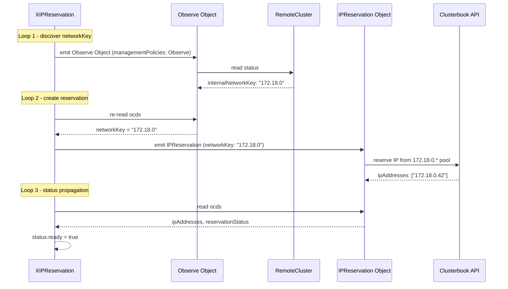

# IPReservation

Crossplane composition that reserves IP addresses from a clusterbook network pool. It automatically reads the `internalNetworkKey` from an existing `RemoteCluster` resource (provider-kubeconfig) and uses it as the network key for the `IPReservation` (provider-clusterbook).

## Flow

```mermaid
flowchart LR
    subgraph mgmt["Management Cluster (dev)"]
        RC["RemoteCluster\n(provider-kubeconfig)"]
        XR["XIPReservation\n(composition)"]
        OBS["Object\n(Observe)"]
        IPO["Object\n(IPReservation wrapper)"]
        IPR["IPReservation\n(provider-clusterbook)"]
        CB["Clusterbook API"]
    end

    subgraph target["Target Cluster (xplane-test)"]
        NODES["Nodes\n172.18.0.5\n172.18.0.7"]
    end

    NODES -- "kubeconfig secret" --> RC
    RC -- "status.atProvider\n.internalNetworkKey: 172.18.0" --> OBS
    XR -- "1. emit Observe Object" --> OBS
    OBS -- "ocds: networkKey = 172.18.0" --> XR
    XR -- "2. emit IPReservation Object\nnetworkKey: 172.18.0" --> IPO
    IPO -- "manages" --> IPR
    IPR -- "reserves IP from\nnetwork 172.18.0.*" --> CB
    CB -- "status.atProvider\n.ipAddresses" --> IPR

    style RC fill:#4a9eff,color:#fff
    style XR fill:#ff6b6b,color:#fff
    style IPR fill:#51cf66,color:#fff
    style CB fill:#ffd43b,color:#000
    style OBS fill:#4a9eff,color:#fff,stroke-dasharray: 5 5
    style IPO fill:#51cf66,color:#fff,stroke-dasharray: 5 5
```



### Reconciliation Sequence



## API

- **Group:** `platform.stuttgart-things.com`
- **Version:** `v1alpha1`
- **XR Kind:** `XIPReservation`
- **Scope:** `Namespaced` (no claim — v2 XRD)

### Spec Fields

| Field | Type | Required | Default | Description |
|-------|------|----------|---------|-------------|
| `clusterName` | string | yes | | Name of the RemoteCluster to read networkKey from |
| `count` | integer | no | `1` | Number of IPs to reserve |
| `ip` | string | no | | Explicit IP (skips auto-reservation) |
| `createDNS` | boolean | no | `false` | Create PDNS wildcard record |
| `clusterbookProviderConfigRef` | string | no | `default` | Clusterbook ClusterProviderConfig name |

### Status Fields

| Field | Type | Description |
|-------|------|-------------|
| `ready` | boolean | True when IPReservation is ready |
| `networkKey` | string | internalNetworkKey from RemoteCluster |
| `ipAddresses` | []string | Reserved IP addresses |
| `reservationStatus` | string | e.g. ASSIGNED, ASSIGNED:DNS |

## Prerequisites

- Crossplane `>=2.13.0` on the management cluster
- `provider-kubeconfig` >= v0.8.0 (provides `internalNetworkKey`)
- `provider-clusterbook` installed with a `ClusterProviderConfig`
- `provider-kubernetes` installed (for Observe Object)
- Functions: `function-kcl` (v0.10.4), `function-auto-ready` (v0.6.0)
- A `RemoteCluster` resource for the target cluster

## Install

```bash
export KUBECONFIG=~/.kube/dev

kubectl apply -f apis/definition.yaml
kubectl apply -f compositions/ip-reservation.yaml
```

## Test

```bash
kubectl apply -f examples/ip-reservation.yaml

# Watch status
kubectl get xipreservations.platform.stuttgart-things.com -A

# Check observed RemoteCluster and IPReservation
kubectl get objects.kubernetes.m.crossplane.io -A | grep observe-rc
kubectl get ipreservations.ipreservation.clusterbook.stuttgart-things.com -A

# Check status fields
kubectl get xipreservations.platform.stuttgart-things.com test-ip-reservation \
  -n crossplane-system -o jsonpath='{.status}' | python3 -m json.tool
```

## Cleanup

```bash
kubectl delete -f examples/ip-reservation.yaml
kubectl delete -f compositions/ip-reservation.yaml
kubectl delete -f apis/definition.yaml
```

## DEV

Local render (no cluster required):

```bash
crossplane render examples/ip-reservation.yaml \
  compositions/ip-reservation.yaml \
  examples/functions.yaml \
  --include-function-results
```
