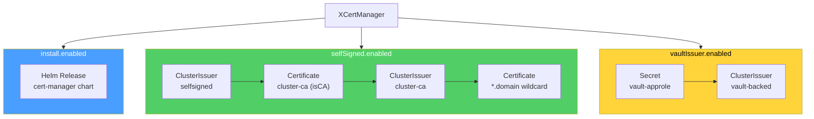

# CertManager

Crossplane composition for deploying cert-manager and configuring certificate issuers on target clusters. Each component is independently toggleable.

## Components



| Component | Boolean | What it creates |
|-----------|---------|-----------------|
| Install | `install.enabled` | Helm Release (cert-manager) |
| SelfSigned CA | `selfSigned.enabled` | SelfSigned issuer, CA cert, CA issuer |
| Wildcard cert | `selfSigned.wildcard.enabled` | Wildcard Certificate from CA |
| Vault issuer | `vaultIssuer.enabled` | AppRole Secret + Vault ClusterIssuer |

## API

- **Group:** `platform.stuttgart-things.com`
- **Version:** `v1alpha1`
- **XR Kind:** `XCertManager`
- **Scope:** `Namespaced` (no claim — v2 XRD)

### Spec Fields

#### targetCluster (required)

| Field | Type | Description |
|-------|------|-------------|
| `name` | string | Helm ClusterProviderConfig |
| `kubernetesRef` | string | Kubernetes ClusterProviderConfig |

#### install

| Field | Type | Default | Description |
|-------|------|---------|-------------|
| `enabled` | boolean | `true` | Deploy cert-manager Helm chart |
| `version` | string | `v1.20.0` | Chart version |
| `namespace` | string | `cert-manager` | Target namespace |
| `installCRDs` | boolean | `true` | Install CRDs via Helm |

#### selfSigned

| Field | Type | Default | Description |
|-------|------|---------|-------------|
| `enabled` | boolean | `false` | Create self-signed CA chain |
| `caName` | string | `cluster-ca` | CA certificate name |
| `caSecretName` | string | `cluster-ca-secret` | CA secret name |
| `wildcard.enabled` | boolean | `true` | Create wildcard cert from CA |
| `wildcard.name` | string | `wildcard-tls` | Certificate name |
| `wildcard.namespace` | string | `default` | Certificate namespace |
| `wildcard.secretName` | string | `wildcard-tls` | TLS secret name |
| `wildcard.domain` | string | | Domain (e.g. `sthings.io` for `*.sthings.io`) |
| `wildcard.duration` | string | `2160h` | Cert duration (90 days) |
| `wildcard.renewBefore` | string | `360h` | Renew before expiry (15 days) |

#### vaultIssuer

| Field | Type | Default | Description |
|-------|------|---------|-------------|
| `enabled` | boolean | `false` | Create Vault ClusterIssuer |
| `name` | string | `cluster-issuer-approle` | Issuer name |
| `vaultAddr` | string | | Vault server URL |
| `pkiPath` | string | | Vault PKI sign path |
| `caBundle` | string | | Base64 CA bundle |
| `roleId` | string | | AppRole role ID |
| `secretId` | string | | AppRole secret ID |

### Status Fields

| Field | Type | Description |
|-------|------|-------------|
| `ready` | boolean | True when all enabled components are Ready |
| `installReady` | boolean | cert-manager Helm release |
| `selfSignedReady` | boolean | CA chain + wildcard cert |
| `vaultIssuerReady` | boolean | Vault ClusterIssuer |
| `certManagerVersion` | string | Installed version |

## Prerequisites

- Crossplane `>=2.13.0` on the management cluster
- `provider-helm` and `provider-kubernetes` with ClusterProviderConfigs for the target cluster
- Functions: `function-kcl` (v0.10.4), `function-auto-ready` (v0.6.0)

## Install

```bash
export KUBECONFIG=~/.kube/dev

kubectl apply -f apis/definition.yaml
kubectl apply -f compositions/cert-manager.yaml
```

## Test

```bash
kubectl apply -f examples/cert-manager.yaml

kubectl get xcertmanagers.platform.stuttgart-things.com -A
kubectl get releases.helm.m.crossplane.io -A | grep cert-manager
kubectl get objects.kubernetes.m.crossplane.io -A | grep test-cert-manager

kubectl get xcertmanagers.platform.stuttgart-things.com test-cert-manager \
  -n crossplane-system -o jsonpath='{.status}' | python3 -m json.tool
```

Verify on the target cluster:

```bash
export KUBECONFIG=~/.kube/xplane-test

kubectl get pods -n cert-manager
kubectl get clusterissuers
kubectl get certificates -A
kubectl get secrets wildcard-tls -n default
```

## Cleanup

```bash
export KUBECONFIG=~/.kube/dev
kubectl delete -f examples/cert-manager.yaml
kubectl delete -f compositions/cert-manager.yaml
kubectl delete -f apis/definition.yaml
```

## DEV

```bash
crossplane render examples/cert-manager.yaml \
  compositions/cert-manager.yaml \
  examples/functions.yaml \
  --include-function-results
```
