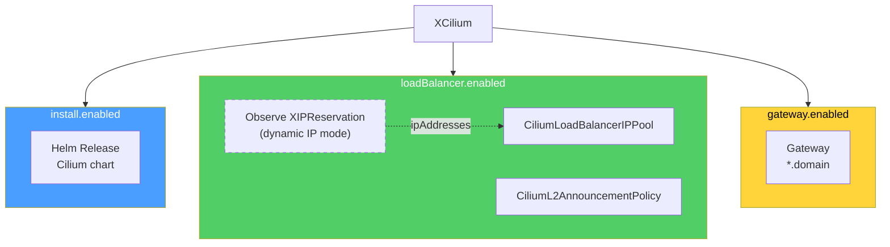

# Cilium

Crossplane composition for deploying and configuring Cilium CNI on target clusters. Each component is independently toggleable — deploy only what you need.

## Components



| Component | Boolean | What it creates |
|-----------|---------|-----------------|
| Cilium install | `install.enabled` | Helm Release (cilium chart) |
| LoadBalancer | `loadBalancer.enabled` | CiliumLoadBalancerIPPool + CiliumL2AnnouncementPolicy |
| Gateway | `gateway.enabled` | Gateway (gateway.networking.k8s.io/v1) |

## API

- **Group:** `platform.stuttgart-things.com`
- **Version:** `v1alpha1`
- **XR Kind:** `XCilium`
- **Scope:** `Namespaced` (no claim — v2 XRD)

### Spec Fields

#### targetCluster (required)

| Field | Type | Description |
|-------|------|-------------|
| `name` | string | Helm ClusterProviderConfig |
| `kubernetesRef` | string | Kubernetes ClusterProviderConfig |

#### install

| Field | Type | Default | Description |
|-------|------|---------|-------------|
| `enabled` | boolean | `true` | Deploy Cilium Helm chart |
| `version` | string | `1.19.2` | Chart version |
| `namespace` | string | `kube-system` | Target namespace |
| `kubeProxyReplacement` | boolean | `true` | Enable kube-proxy replacement |
| `k8sServiceHost` | string | | API server host |
| `k8sServicePort` | integer | `6443` | API server port |
| `gatewayAPI.enabled` | boolean | `true` | Enable Gateway API support |
| `l2Announcements.enabled` | boolean | `true` | Enable L2 announcements |
| `externalIPs.enabled` | boolean | `true` | Enable external IPs |
| `operator.replicas` | integer | `1` | Operator replicas |

#### loadBalancer

| Field | Type | Default | Description |
|-------|------|---------|-------------|
| `enabled` | boolean | `false` | Create LB IP pool + L2 policy |
| `ipMode` | string | `static` | `static` (provide range) or `dynamic` (from XIPReservation) |
| `ipRange.start` | string | | Start IP (static mode) |
| `ipRange.end` | string | | End IP (static mode) |
| `reservationRef` | string | | XIPReservation name (dynamic mode) |
| `poolName` | string | `default-pool` | CiliumLoadBalancerIPPool name |
| `l2PolicyName` | string | `default-l2-announcement-policy` | L2 policy name |

#### gateway

| Field | Type | Default | Description |
|-------|------|---------|-------------|
| `enabled` | boolean | `false` | Create Gateway resource |
| `name` | string | `cilium-gateway` | Gateway name |
| `namespace` | string | `default` | Gateway namespace |
| `domain` | string | | Wildcard domain (e.g. `sthings.io` for `*.sthings.io`) |
| `tlsSecretName` | string | | TLS secret for HTTPS listener (omit for HTTP only) |

### Status Fields

| Field | Type | Description |
|-------|------|-------------|
| `ready` | boolean | True when all enabled components are Ready |
| `installReady` | boolean | Cilium Helm release status |
| `loadBalancerReady` | boolean | LB pool + L2 policy status |
| `gatewayReady` | boolean | Gateway status |
| `networkKey` | string | Dynamic IP (if using reservationRef) |
| `ciliumVersion` | string | Installed chart version |

## Prerequisites

- Crossplane `>=2.13.0` on the management cluster
- `provider-helm` and `provider-kubernetes` with ClusterProviderConfigs for the target cluster
- `in-cluster` ClusterProviderConfig (InjectedIdentity) if using dynamic IP mode
- Functions: `function-kcl` (v0.10.4), `function-auto-ready` (v0.6.0)

## Install

```bash
export KUBECONFIG=~/.kube/dev

kubectl apply -f apis/definition.yaml
kubectl apply -f compositions/cilium.yaml
```

## Test

```bash
kubectl apply -f examples/cilium.yaml

# Watch status
kubectl get xciliums.platform.stuttgart-things.com -A

# Check Helm release
kubectl get releases.helm.m.crossplane.io -A | grep cilium

# Check LB + Gateway Objects
kubectl get objects.kubernetes.m.crossplane.io -A | grep test-cilium

# Status fields
kubectl get xciliums.platform.stuttgart-things.com test-cilium \
  -n crossplane-system -o jsonpath='{.status}' | python3 -m json.tool
```

Verify on the target cluster:

```bash
export KUBECONFIG=~/.kube/xplane-test

kubectl get pods -n kube-system | grep cilium
kubectl get ciliumloadbalancerippools
kubectl get ciliuml2announcementpolicies
kubectl get gateways -A
```

## Cleanup

```bash
export KUBECONFIG=~/.kube/dev
kubectl delete -f examples/cilium.yaml
kubectl delete -f compositions/cilium.yaml
kubectl delete -f apis/definition.yaml
```

## DEV

```bash
crossplane render examples/cilium.yaml \
  compositions/cilium.yaml \
  examples/functions.yaml \
  --include-function-results
```
